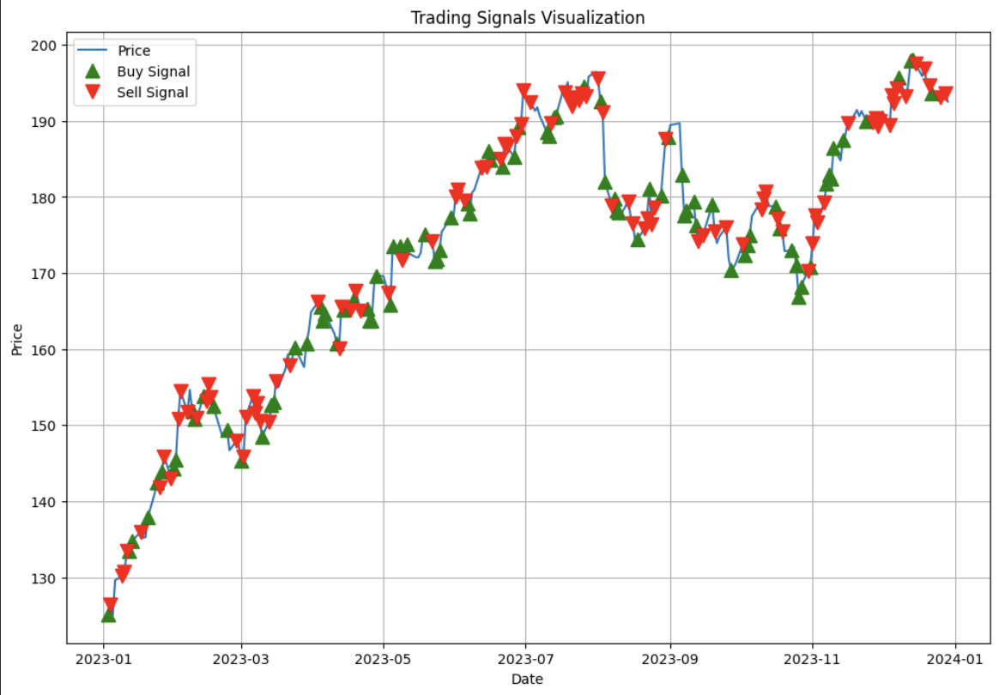
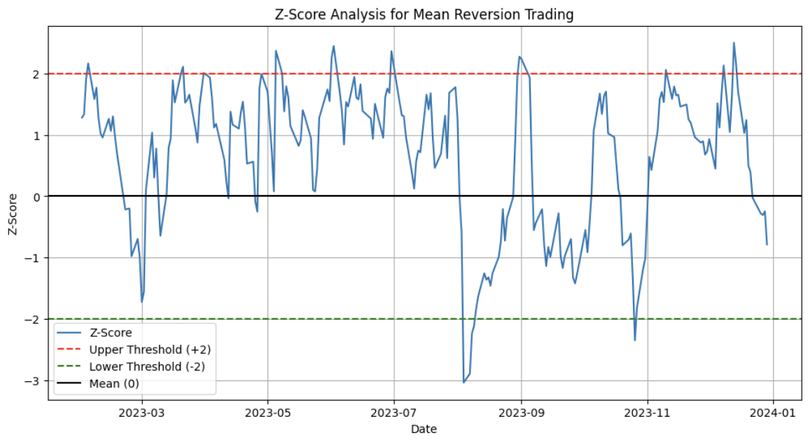
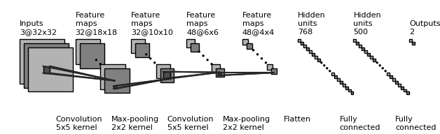

# Project Arbo

Project Arbo aims to explore and exploit temporal price inefficiencies across multiple asset classes using advanced statistical and machine learning techniques. The focus is on leveraging deep learning, reinforcement learning, and other state-of-the-art methodologies to build a robust statistical arbitrage framework that adapts to various market conditions and asset types, such as stocks, ETFs, and futures.

## Table of Contents

1. [Problem Definition](#problem-definition)
2. [Data Collection](#data-collection)
3. [Data Exploration and Preparation](#data-exploration-and-preparation)
4. [Analysis and Modeling Techniques](#analysis-and-modeling-techniques)
5. [Baseline Model and Improvement](#baseline-model-and-improvement)
6. [Performance Evaluation and Visualization](#performance-evaluation-and-visualization)
7. [Backtesting](#backtesting)
8. [References](#references)

## Problem Definition

> Can temporal price inefficiencies between two or more assets (stocks, ETFs, or commodity futures) be identified and exploited using advanced statistical methods, such as deep learning-based mean reversion and reinforcement learning?

Project Arbo focuses on answering this question by developing models that can dynamically adapt to market changes and capture profitable trading opportunities based on statistical arbitrage principles.

## Data Collection

To build robust statistical arbitrage models, **high-frequency data** from multiple markets is essential. This includes not just asset prices but also **exogenous data** such as volume, volatility, and macroeconomic indicators. The project will also consider historical order book data to capture microstructure effects.

**Action Items**:

- Collect high-frequency data for stocks, ETFs, and futures contracts.
- Include additional data sources like order books, futures market data, and macroeconomic indicators for enhanced predictive capabilities.
- Evaluate various data providers for quality, latency, and historical depth.

## Data Exploration and Preparation

One of the critical steps is to identify co-moving assets that can form arbitrage portfolios. We will use **correlation matrix clustering** to group assets that exhibit similar behaviors, aiding in the formation of mean-reverting strategies.

**Action Items**:

- Apply graph-based clustering on the correlation matrix of asset returns to identify clusters for statistical arbitrage.
- Use **Kalman filters** or **adaptive filters** to dynamically adjust predictions, which will be useful for modeling partial co-integration and improving model accuracy over time.

## Analysis and Modeling Techniques

For robust mean reversion and cointegration models, we propose incorporating **Hidden Markov Models (HMMs)** to capture regime-switching behaviors and identify price misalignments more effectively. **Reinforcement learning** will also be utilized to optimize trade decisions, helping adapt strategies based on real-time feedback.

**Action Items**:

- Integrate HMMs to detect regime shifts and improve the effectiveness of the mean reversion model.
- Develop **deep reinforcement learning** models (e.g., Advantage Actor-Critic [A2C] and Asynchronous A3C) to create adaptive trading strategies that continuously learn from market behavior.

## Baseline Model and Improvement

We will begin by establishing a simple baseline using **Ornstein-Uhlenbeck (OU)** models for mean reversion and then enhance this baseline with more sophisticated methods like **Convolutional Neural Networks (CNNs)** and **Transformers**. Reinforcement learning techniques will be integrated to make the trading framework more adaptive.

**Action Items**:

- Develop a baseline **OU process** model for mean reversion trading.
- Enhance the baseline with **deep learning** methods such as CNNs and RNNs.
- Introduce **Reinforcement Learning** (A2C, A3C) for real-time decision-making.

## Performance Evaluation and Visualization

Evaluating model performance goes beyond just traditional metrics like Sharpe Ratio. We will also include metrics related to **drawdown risk**, **reward functions** from reinforcement learning, and risk-adjusted returns under realistic constraints.

**Action Items**:

- Implement evaluation metrics for **risk-adjusted returns**, drawdown, and real-world constraints like transaction costs.
- Visualize trading decisions and returns across different regimes identified by HMMs.

## Backtesting

To ensure that our models can adapt over time, we will use a **rolling-window backtesting approach** with **walk-forward optimization**. This method allows the model to learn continuously and adjust strategies based on new data.

**Action Items**:

- Develop a **reinforcement learning-based backtesting framework** that dynamically updates as it receives new data.
- Track performance metrics like returns, Sharpe Ratios, and risk exposure while accounting for **transaction costs** and liquidity constraints.

## References

Here are the references in markdown format:

### References

1. **Deep Learning Statistical Arbitrage**  
   Jorge Guijarro-Ordonez, Markus Pelger, Greg Zanotti.  
   *Deep Learning Statistical Arbitrage*, Stanford University.  
   [Available here](https://ssrn.com/abstract=3862004)

2. **Statistical Arbitrage on the JSE Based on Partial Co-Integration**  
   A. J. Hoffman.  
   *Investment Analysts Journal, 50(2), 110-132* (2021).  
   [Available here](https://doi.org/10.1080/10293523.2021.1886723)

3. **Correlation Matrix Clustering for Statistical Arbitrage Portfolios**  
   Álvaro Cartea, Mihai Cucuringu, Qi Jin.  
   *4th ACM International Conference on AI in Finance* (2023).  
   [Available here](https://doi.org/10.1145/3604237.3626894)

4. **High-Frequency Statistical Arbitrage in Chinese Futures Market**  
   Chengying He, Tianqi Wang, Xinwen Liu, Ke Huang.  
   *Journal of Innovation & Knowledge, 8 (2023) 100429*.  
   [Available here](https://doi.org/10.1016/j.jik.2023.100429)

5. **Statistical Arbitrage Trading on the Intraday Market Using the Asynchronous Advantage Actor–Critic Method**  
   Sumeyra Demir, Bart Stappers, Koen Kok, Nikolaos G. Paterakis.  
   *Applied Energy, 314 (2022) 118912*.  
   [Available here](https://doi.org/10.1016/j.apenergy.2022.118912)

6. **Exploring Arbitrage Opportunities Between China's Carbon Markets Based on Statistical Arbitrage Pairs Trading Strategy**  
   Boqiang Lin, Zhizhou Tan.  
   *Environmental Impact Assessment Review, 99 (2023) 107041*.  
   [Available here](https://doi.org/10.1016/j.eiar.2023.107041)

7. **Statistical Arbitrage in the Freight Options Market**  
   Roar Adland, Lars Eirik Anestad, Bjarte Abrahamsen.  
   *Maritime Policy & Management, 50(2), 141-156* (2023).  
   [Available here](https://doi.org/10.1080/03088839.2021.1975055)

8. **Advanced Statistical Arbitrage with Reinforcement Learning**  
   Boming Ning, Kiseop Lee.  
   *Department of Statistics, Purdue University* (2024).  
   [Available here](https://ssrn.com/abstract=4739373)

9. **Statistical Arbitrage Trading Across Electricity Markets Using Advantage Actor–Critic Methods**  
   Sumeyra Demir, Koen Kok, Nikolaos G. Paterakis.  
   *Sustainable Energy, Grids and Networks, 34 (2023) 101023*.  
   [Available here](https://doi.org/10.1016/j.segan.2023.101023)

10. **Hidden Markov Model for Statistical Arbitrage in International Crude Oil Futures Markets**  
    Viviana Fanelli, Claudio Fontana, Francesco Rotondi.  
    *University of Padova* (2024).  
    [Available here](https://doi.org/10.1016/j.jik.2023.100429)

11. **Expectations for Statistical Arbitrage in Energy Futures Markets**  
    Tadahiro Nakajima.  
    *Journal of Risk and Financial Management, 12(1), 14* (2019).  
    [Available here](https://doi.org/10.3390/jrfm12010014)
